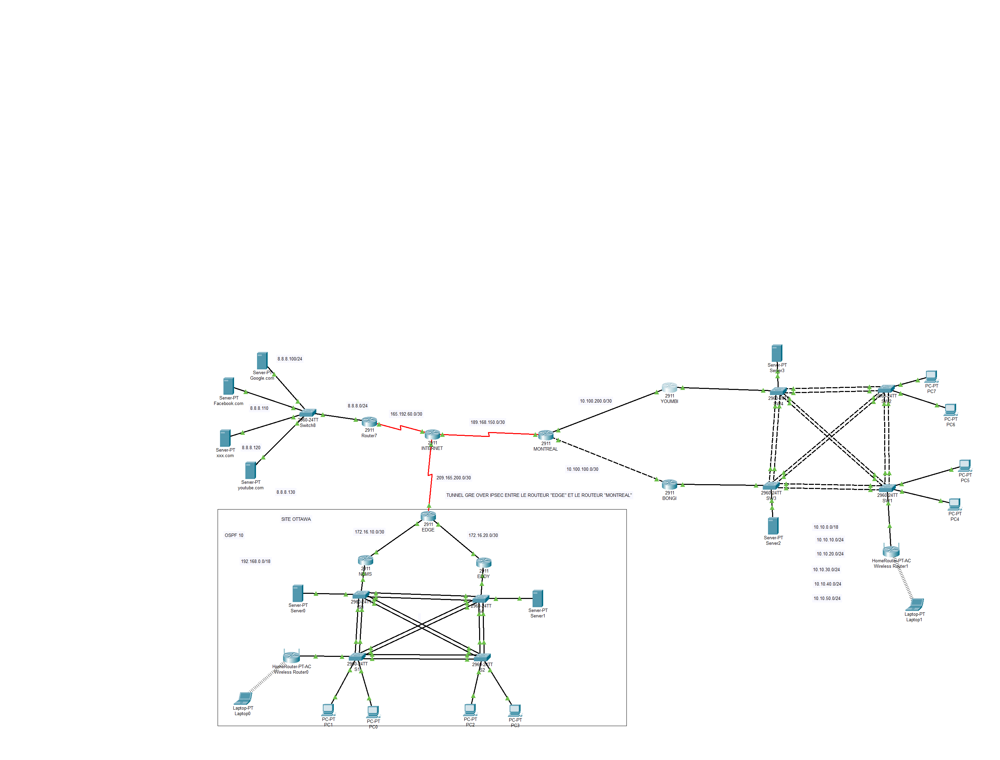

Network Upgrade for a Financial Institution

📝 Introduction

This project involves modernizing and enhancing the network architecture of a financial institution whose infrastructure had not been updated since 2000. The goal is to implement a reliable, secure, and easily manageable infrastructure using Cisco equipment and advanced configurations.

In this simulations, the users from inside the network are not allowed to access certains website, and can be able to connect to another network site using the VPN.

🗺️ Network Architecture

The network architecture consists of the following components:

Cisco 2911 routers (for inter-network routing and Internet access)

Cisco 2960 switches (for network segmentation using VLANs)

Cisco ASA firewall (for perimeter security)

Wireless access points (for Wi-Fi connectivity)

Servers (FTP, DNS, DHCP) 

Desktop and laptop computers for administration

Network Diagram

🛠️ Technologies Used

Cisco IOS for configuring routers and switches

Cisco ASA for network security

VLANs for network segmentation

Static and dynamic routing (OSPF, EIGRP)

Security via ACLs and NAT

Network monitoring using SNMP

Redundancy protocols: STP (Rapid-PVST) and HSRP

LACP for link aggregation

🚀 Implemented Features

Dynamic Routing (OSPF, EIGRP): Ensures efficient communication between subnets

Perimeter Security (ASA Firewall): Blocks unauthorized access

VLAN Segmentation: Isolates different functional areas

QoS (Quality of Service): Prioritizes critical traffic

Layer 2 Redundancy (STP): Rapid-PVST configuration for network stability

Layer 3 Redundancy (HSRP): Ensures high availability with standby routers

Link Aggregation (LACP): Optimizes network performance

Automated Configuration Backups

⚙️ Detailed Configuration

All device configurations are available in the config/ directory.

Sample Configuration - Main Router

interface GigabitEthernet0/0
 ip address 192.168.1.1 255.255.255.0
 ip nat inside
!
router ospf 1
 network 192.168.1.0 0.0.0.255 area 0
!
ip access-list extended SECURE_ACCESS
 permit tcp any any eq 443
 deny ip any any

📂 Documentation

Detailed reports and documentation are available in the docs/ directory.

✅ Testing Instructions

Deploy the configurations on devices via CLI.

Verify connectivity between subnets.

Validate firewall rules and access control lists (ACLs).

📝 Authors

Created by Nehemie Kembo Bongi as part of an academic capstone project.
Project created in 2023
